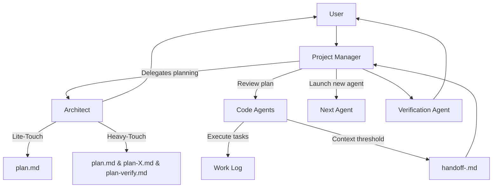

# Adaptive Mode Workflow

The following Mermaid diagram summarizes the adaptive workflow outlined in `readme.md`.

```mermaid
graph TD
    U[User] --> PM[Project Manager]
    PM -->|Delegates planning| A[Architect]
    A -->|Lite-Touch| PlanLite[plan.md]
    A -->|Heavy-Touch| PlanHeavy[plan.md & plan-X.md & plan-verify.md]
    A --> U
    PM -->|Review plan| Code[Code Agents]
    Code -->|Execute tasks| Work[Work Log]
    Code -->|Context threshold| Handoff[handoff-<timestamp>.md]
    Handoff --> PM
    PM -->|Launch new agent| NewAgent[Next Agent]
    PM --> Verify[Verification Agent]
    Verify --> U
```
